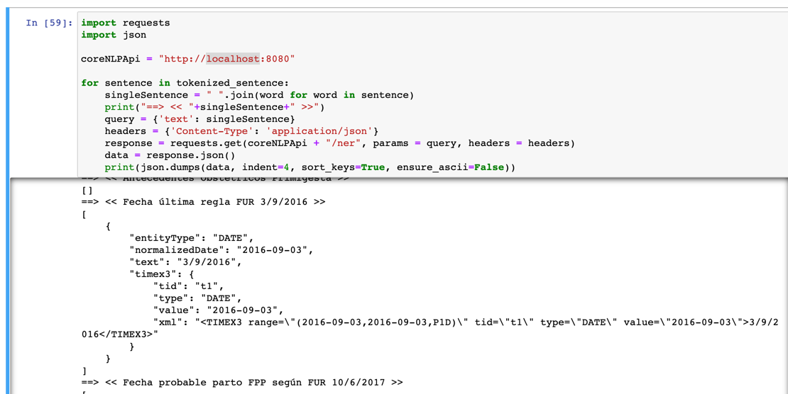

# CoreNLP API

This is a microservice that performs NER using CoreNLP and SUTime in spanish. ITs aim is to identify and tag temporal expressions.

## Corpus used

Since this service deals with phenotypical and temporal information, there are 2 types of corpus that this service handles:

### Spanish translatin of HPO corpus

HPO (or The Human Phenotype Ontology) provides a standardized vocabulary of phenotypic abnormalities encountered in human diseases. 
HPO currently contains over 13,000 terms and over 156,000 annotations to hereditary diseases. 

Although this vocabulary is available in english only, there are initiatives to provide the translations in different languages such as [this one in Crowdin](https://crowdin.com/project/hpo-translation).

For spanish, there is [this initiative](https://github.com/drseb/HPO-translations) that is trying to translate all HPO's labels, synonyms and textual definitions. 
We have generated a set of rules from [this excel file](https://github.com/drseb/HPO-translations/blob/master/offline-translations/spanish/orig/HPO-Spanish.xlsx), being the result the file called __kbp_hpo_es_regexner_mapping.tag__ included in this repository.

### HourGlass from Annotador

## Pipeline

## Getting Started

Since this Spring Boot service is containerized you should execute the following commands to run it

```
docker build -t core-nlp-api .
```

To run the image just execute

```
docker run -it -p 8080:8080 core-nlp-api
```

## Run some requests

In order to call the service execute the following CURL sentence:

```
curl --location --request GET 'http://localhost:8080/ner?text=mañana, 30 de diciembre, 1/1/81, ayer'
```

And the respose should be something like this (considering the anchor date today 2022-06-29).

```json
[
  {
    "text": "mañana",
    "entityType": "DATE",
    "normalizedDate": "2022-07-01",
    "timex3": {
      "tid": "t1",
      "type": "DATE",
      "value": "2022-07-01",
      "xml": "<TIMEX3 range=\"(2022-07-01,2022-07-01,P1D)\" tid=\"t1\" type=\"DATE\" value=\"2022-07-01\">maￃﾱana</TIMEX3>"
    }
  },
  {
    "text": "30 de diciembre",
    "entityType": "DATE",
    "normalizedDate": "2021-12-30",
    "timex3": {
      "tid": "t2",
      "type": "DATE",
      "value": "2021-12-30",
      "xml": "<TIMEX3 range=\"(2021-12-30,2021-12-30,P1D)\" tid=\"t2\" type=\"DATE\" value=\"2021-12-30\">30 de diciembre</TIMEX3>"
    }
  },
  {
    "text": "1/1/81",
    "entityType": "DATE",
    "normalizedDate": "1981-01-01",
    "timex3": {
      "tid": "t3",
      "type": "DATE",
      "value": "1981-01-01",
      "xml": "<TIMEX3 range=\"(1981-01-01,1981-01-01,P1D)\" tid=\"t3\" type=\"DATE\" value=\"1981-01-01\">1/1/81</TIMEX3>"
    }
  },
  {
    "text": "ayer",
    "entityType": "DATE",
    "normalizedDate": "2022-06-29",
    "timex3": {
      "tid": "t4",
      "type": "DATE",
      "value": "2022-06-29",
      "xml": "<TIMEX3 range=\"(2022-06-29,2022-06-29,P1D)\" tid=\"t4\" type=\"DATE\" value=\"2022-06-29\">ayer</TIMEX3>"
    }
  }
]
```

## Run the notebooks

* Open the file __"notebooks/Recognition of Biomedical and Temporal entities.ipynb"__ inside as a Jupyter notebook.
* In order to test a EHR copy one of the files to the same folder in which this notebook file is located (don't forget to put the same name into the notebook)
* Execute the notebook. The notebook contains 2 phases so far: The preprocessing and the identification of dates in the EHR. The tokenization or preprocessing part is self explanatory and for the NER task itself I'm calling the service for each sentence identified, as seen in the following screenshot



## Troubleshooting

* If the connection with the service doesn't work try your IP instead of localhost.
* The build usually takes a few minutes, because CoreNLP has to load all the files and is not fast, if it fails for some reason launch the build again.

## Licence

GNU General Public License v3.0