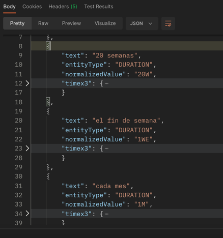
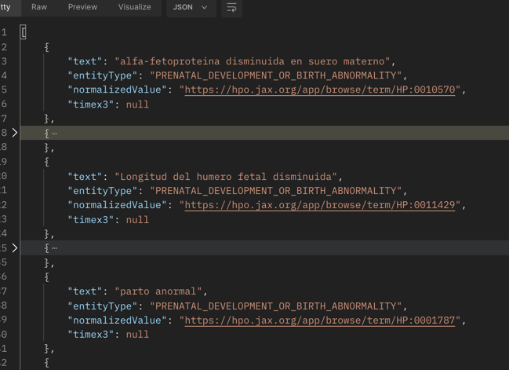

# PhenoTyme

PhenoTyme - An acronym from PHENOtypic and TYME ;-) - is a microservice that performs NER using CoreNLP and SUTime in spanish. ITs aim is to identify and tag temporal and phenotypical expressions using [Añotator](https://github.com/mnavasloro/Annotador) and the [Translated rules from HPO](https://github.com/drseb/HPO-translations) respectively.

## Corpus used

Since this service deals with phenotypical and temporal information, there are 2 types of corpus that this service handles:

### Spanish translation of HPO corpus

HPO (or The Human Phenotype Ontology) provides a standardized vocabulary of phenotypic abnormalities encountered in human diseases. 
HPO currently contains over 13,000 terms and over 156,000 annotations to hereditary diseases. 

Although this vocabulary is available in english only, there are initiatives to provide the translations in different languages such as [this one in Crowdin](https://crowdin.com/project/hpo-translation).

For spanish, there is [this initiative](https://github.com/drseb/HPO-translations) that is trying to translate all HPO's labels, synonyms and textual definitions. 
We have generated a set of rules from [this excel file](https://github.com/drseb/HPO-translations/blob/master/offline-translations/spanish/orig/HPO-Spanish.xlsx), being the result the file called __kbp_hpo_es_regexner_mapping.tag__ included in this repository.

### HourGlass and Añotador

We're using [Añotador](https://annotador.oeg.fi.upm.es/) (and the [HourGlass](https://annotador.oeg.fi.upm.es/hourglass.html]) corpus to annotate and normalize temporal expressions in spanish. 
The source code of this system is [here](https://github.com/mnavasloro/Annotador). 
Since this dependency we're using from Añotador is not published in Maven Central or in any public repository we had to 
build the Añotador project locally, that generates the library in the local .m2 maven folder.
After that we need to manually include the dependency in our project.

* If you want to run it in your local environment (no container) the dependency already is in the .m2 folder so there's no need to include it manually.
* For the docker container, we have to include this file in our project and copy it to the .m2 folder in the container for the buid to work correctly.

## Getting Started

Since this Spring Boot service is containerized you should execute the following commands to run it

```
docker build -t phenotyme .
```

To run the image just execute

```
docker run -it -p 8080:8080 phenotyme
```

## Run some requests

* This request will test temporal information:

```
curl --location --request GET 'http://localhost:8080/ner?text=20 semanas, el fin de semana, cada mes, la madrugada'
```

And the respose should be something like this (considering the anchor date today 2022-06-29).



* And for phenotypical information run this request

```
curl --location --request GET 'http://localhost:8080/ner?text=Se ha verificado que la alfa-fetoproteina disminuida en suero materno cita para el 20 de enero, es probable que tambien tenga Longitud del humero fetal disminuida el 15/01/2020 por lo que se trataría de un parto anormal, los padres están de acuerdo con terminar el embarazo'
```

And the respose should look like this:



## Run the notebooks

* Open the file __"notebooks/Recognition of Biomedical and Temporal entities.ipynb"__ inside as a Jupyter notebook.
* In order to test a EHR copy one of the files to the same folder in which this notebook file is located (don't forget to put the same name into the notebook)
* Execute the notebook. The notebook contains 2 phases so far: The preprocessing and the identification of dates in the EHR. The tokenization or preprocessing part is self explanatory and for the NER task itself I'm calling the service for each sentence identified, as seen in the following screenshot


## Troubleshooting

* The build usually takes several minutes, because CoreNLP has to load all the files and is not fast, if it fails for some reason (timeouts or memory issues within the container) just remove the image and launch the commands again.
* If the connection with the service doesn't work try your IP instead of localhost.

## Licence

GNU General Public License v3.0